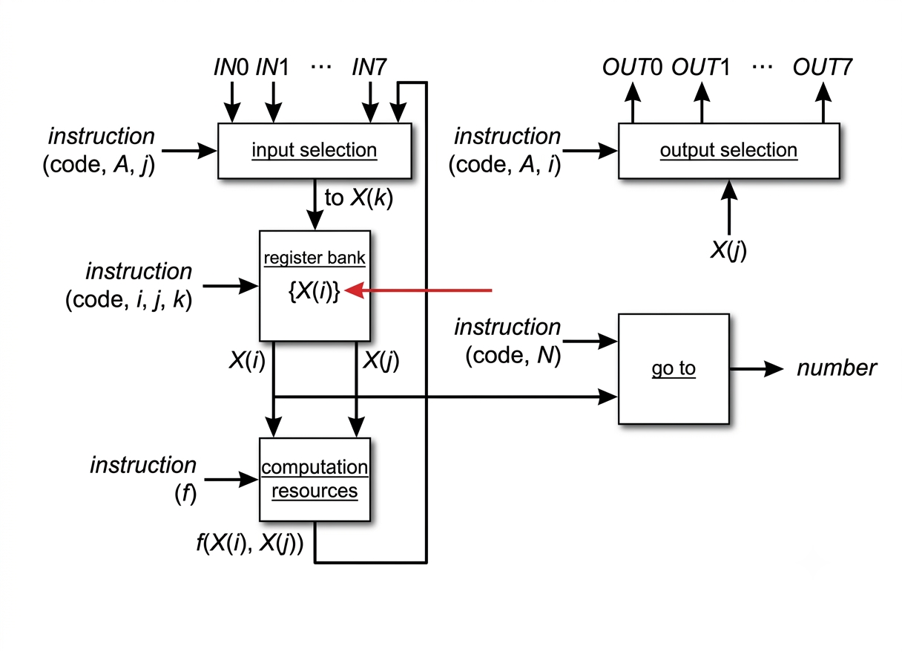

# MiniCPU-DesignAndTest

A Verilog-based project for designing and testing a simple Mini CPU. This repository contains the RTL implementation of a basic CPU architecture, along with associated testbenches and scripts for simulation.

## Features

- Written primarily in Verilog (93.3%)
- Includes Makefile scripts (6.7%) for building and simulating designs
- Modular CPU design suitable for educational purposes
- Testbenches for functional verification

## Directory Structure

```
MiniCPU-DesignAndTest/
├── rtl/                      # Verilog RTL source files for CPU components
├── tb/                       # Testbenches for simulation and verification
├── sim/                      # Build and simulation automation scripts
├── block_diagrams/           # Block diagrams and architecture visualizations
│   ├── block-diagram.png        # Overall CPU block diagram
│   ├── processor_top.png        # Top-level processor architecture
│   ├── arithmetic_unit.png      # ALU architecture
│   ├── register_bank.png        # Register file design
│   ├── input_selection.png      # Input multiplexer logic
│   ├── output_selection.png     # Output multiplexer logic
│   └── go_to.png                # Branch/Jump control logic
├── BUG_LOG.md                # Known issues and bug tracking
└── README.md                 # Project documentation
```

## Getting Started

### Prerequisites

- Verilog simulator (e.g., Icarus Verilog, ModelSim, or Vivado)
- GNU Make

### Build and Run

1. Clone the repository:
    ```sh
    git clone https://github.com/amirmuallim/MiniCPU-DesignAndTest.git
    cd MiniCPU-DesignAndTest/sim
    ```

2. Build and simulate using Make:
    ```sh
    make
    ```

   This will compile the Verilog files and run the included testbenches.

3. To clean build artifacts:
    ```sh
    make clean
    ```

## Datapath Architecture

The MiniCPU employs a simplified datapath architecture designed for educational purposes and efficient instruction execution:



The datapath integrates key CPU components including the instruction fetch unit, decoder, ALU, registers, and memory interfaces to execute a complete instruction cycle. Additional architectural details can be found in the `block_diagrams/` directory.

## Contributing

Contributions, issues, and feature requests are welcome! Please open a pull request or submit an issue via the Issues tab.

## License

This project is licensed under the MIT License.

## Author

Created and maintained by [amirmuallim](https://github.com/amirmuallim).
